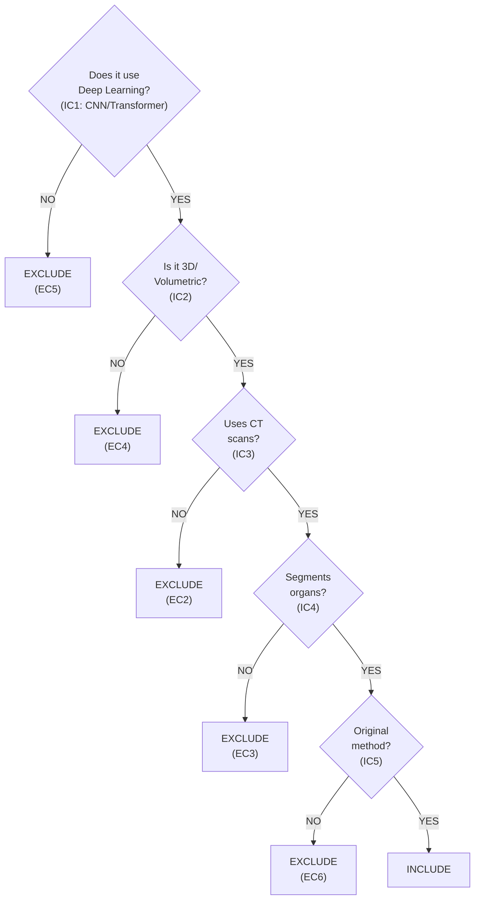

# S2 Screening Criteria for AI-Assisted Paper Selection

## Survey Topic
**"3D Organ Segmentation from CT Scans using Deep Learning"**

A systematic survey focused on clinical translation for surgical planning applications.

---

## Inclusion Criteria (ALL must be met)

### IC1: Deep Learning Method
- **Required**: Uses deep learning architectures (CNN, Transformer, U-Net variants, encoder-decoder networks, attention mechanisms)
- **Includes**: ResNet, VGG, DenseNet, EfficientNet backbones; U-Net, V-Net, 3D U-Net, nnU-Net; Vision Transformers, Swin Transformer, UNETR; Hybrid CNN-Transformer approaches; SAM, MedSAM foundation models
- **Excludes**: Traditional machine learning (SVM, Random Forest, k-means); Rule-based or threshold-based methods; Classical image processing (watershed, region growing, active contours without DL); Shallow neural networks (<3 layers)

### IC2: 3D Volumetric Segmentation
- **Required**: Processes volumetric data with 3D spatial context
- **Includes**: Native 3D convolutions (3D U-Net, V-Net); 2.5D approaches using adjacent slices; Slice-by-slice with 3D post-processing/refinement; Recurrent methods aggregating slice features
- **Excludes**: Pure 2D slice-by-slice without volumetric context; Single-slice segmentation only; 2D methods without any 3D aggregation

### IC3: CT Imaging Modality
- **Required**: Uses Computed Tomography as primary or included modality
- **Includes**: Non-contrast CT; Contrast-enhanced CT (arterial, portal venous, delayed phases); Low-dose CT; Dual-energy CT; Multi-modal studies that include CT (CT+MRI, CT+PET)
- **Excludes**: MRI-only studies; Ultrasound-only; X-ray/radiograph-only; PET-only; Optical imaging; Histopathology

### IC4: Anatomical Organ Segmentation
- **Required**: Segments anatomical organs relevant to clinical diagnosis/planning
- **Target Organs**:
  - **Abdominal**: Liver, kidney (left/right), spleen, pancreas, stomach, gallbladder, adrenal glands
  - **Thoracic**: Lungs (left/right), heart (chambers), esophagus
  - **Other**: Bladder, prostate, uterus, colon
- **Excludes**: 
  - Tumors/lesions only (without organ context)
  - Vessels only (aorta, portal vein, hepatic vessels)
  - Bones/skeletal structures only
  - Muscles only (skeletal muscle, adipose tissue)
  - Airways only
  - Lymph nodes only
- **Edge Cases - INCLUDE if**:
  - Organ + tumor together (liver with hepatic tumors)
  - Multi-organ including vessels as secondary target
  - Organs-at-risk for radiotherapy planning

### IC5: Original Research with Methodology
- **Required**: Presents novel method, architecture, or significant methodological contribution
- **Includes**: New architectures; Novel loss functions for organ segmentation; New training strategies; Benchmark studies comparing methods with new insights; Dataset papers with baseline methods
- **Excludes**: Pure review/survey papers (without novel methodology); Dataset-only papers (no method evaluation); Opinion pieces, editorials, commentaries; Application notes without methodological contribution

### IC6: Publication Timeframe & Language
- **Required**: Published 2015-2026, English language
- **Rationale**: Deep learning for medical imaging began gaining traction ~2015 with U-Net

---

## Exclusion Criteria (ANY triggers exclusion)

### EC1: Detection/Classification Only
Papers focused solely on detecting presence/absence of pathology or classifying disease without performing spatial segmentation.

### EC2: Non-CT Modalities Exclusively
Papers using only MRI, ultrasound, X-ray, PET, or other non-CT imaging without any CT component.

### EC3: Non-Organ Targets Exclusively
Papers segmenting only:
- Tumors/lesions without surrounding organ
- Vascular structures (vessels, arteries, veins)
- Skeletal structures (bones, spine, ribs)
- Soft tissue (muscle, fat, adipose)
- COVID-19 lung lesions (infection, not organ)
- Nodules without organ parenchyma

### EC4: 2D-Only Methods
Methods processing single slices without any volumetric context or 3D post-processing.

### EC5: Traditional ML / Non-DL
Methods using classical machine learning, hand-crafted features, or rule-based approaches.

### EC6: Review Papers Without Novel Method
Survey/review papers that synthesize existing work without presenting new methodology.

### EC7: Insufficient Methodological Detail
Papers lacking reproducibility information (no architecture details, no training parameters, no evaluation metrics).

### EC8: Non-Public Evaluation Only
Papers evaluated only on private datasets with no public benchmark results.

---

## Decision Framework



---

## Edge Case Guidelines

### INCLUDE (with rationale):
| Scenario | Decision | Rationale |
|----------|----------|-----------|
| Liver + tumor segmentation | INCLUDE | Organ is primary target |
| Multi-organ + vessel (secondary) | INCLUDE | Organs are primary targets |
| Organs-at-risk for radiotherapy | INCLUDE | Clinical organ segmentation |
| 2.5D with 3D refinement | INCLUDE | Has volumetric context |
| CT + MRI fusion | INCLUDE | Includes CT modality |
| Low-dose CT denoising + segmentation | INCLUDE | CT organ segmentation |
| Foundation model (SAM) for organs | INCLUDE | DL method for organs |

### EXCLUDE (with rationale):
| Scenario | Decision | Rationale |
|----------|----------|-----------|
| Liver tumor only (no liver) | EXCLUDE | Lesion, not organ (EC3) |
| Aorta segmentation only | EXCLUDE | Vessel, not organ (EC3) |
| Skeletal muscle measurement | EXCLUDE | Muscle, not organ (EC3) |
| COVID-19 lung infection | EXCLUDE | Lesion, not organ parenchyma (EC3) |
| MRI brain segmentation | EXCLUDE | Non-CT (EC2) |
| 2D slice CNN | EXCLUDE | No 3D context (EC4) |
| Random Forest liver seg | EXCLUDE | Non-DL (EC5) |
| Survey of DL methods | EXCLUDE | Review paper (EC6) |
| Classification: COVID vs normal | EXCLUDE | Detection, not segmentation (EC1) |

### UNCERTAIN (requires manual review):
- Borderline 2D/3D (uses 3 slices but unclear if truly volumetric)
- Mixed targets (organs + vessels with unclear primary focus)
- Abstract mentions CT but full-text unclear
- Novel architecture but unclear evaluation
- Preprint with limited methodological detail

---

## AI Screening Protocol

### Prompt Template
```
You are screening papers for a systematic review on "3D Organ Segmentation from CT Scans using Deep Learning".

INCLUSION CRITERIA (ALL must be met):
1. IC1: Uses deep learning (CNN, Transformer, U-Net, etc.) - NOT traditional ML or rule-based
2. IC2: Performs 3D volumetric segmentation - NOT 2D slice-by-slice only
3. IC3: Uses CT imaging modality - NOT MRI, ultrasound, X-ray only
4. IC4: Segments anatomical organs (liver, kidney, lung, heart, spleen, pancreas, etc.) - NOT tumors/lesions only, NOT bones/vessels only, NOT muscles only
5. IC5: Original research with methodology - NOT review papers, NOT datasets-only papers
6. IC6: Published 2015-2026 in English

EXCLUSION CRITERIA (ANY triggers exclusion):
- EC1: Detection/classification without segmentation
- EC2: Non-CT modalities exclusively
- EC3: Non-organ targets only (tumors, vessels, bones, muscles)
- EC4: 2D-only methods without volumetric context
- EC5: Traditional ML / non-deep learning methods
- EC6: Review/survey papers without novel methodology

PAPER TO SCREEN:
Title: {title}
Abstract: {abstract}

Respond with JSON only:
{
  "decision": "INCLUDE" or "EXCLUDE" or "UNCERTAIN",
  "confidence": 0-100,
  "rationale": "Brief explanation",
  "criteria_met": ["IC1", "IC2", ...],
  "criteria_failed": ["EC1", ...]
}
```

### Hallucination Control
1. **3-run majority voting**: Each paper screened 3 times with temperature=0.3
2. **INCLUDE threshold**: Requires 3/3 runs agreeing on INCLUDE (unanimous)
3. **No agreement = EXCLUDE**: If any run disagrees, the paper is excluded (conservative approach)
4. **No UNCERTAIN**: Decisive voting only - papers are either INCLUDE or EXCLUDE
5. **Random sample validation**: 10% sample manually verified by human reviewers

---

## Version History

| Version | Date | Changes |
|---------|------|---------|
| 1.0 | 2026-01-21 | Initial criteria from main.tex methodology |
| 1.1 | 2026-01-21 | Expanded organ list, clarified edge cases |
| 1.2 | 2026-01-21 | Added decision flowchart, edge case table |

---

## References

- PRISMA 2020 Guidelines (Page et al., 2021)
- Survey methodology (Section 2 of main.tex)
- AI-assisted screening protocol (Section 2.3 of main.tex)
